# Citi Bike Demand Forecasting Platform

[Live Demo](https://citibikeprediction-ramprakash.streamlit.app/)

An end-to-end production-style system that predicts next-hour Citi Bike station demand for Jersey City, keeps features/models updated through scheduled pipelines, and serves results in a live dashboard.

## Why This Project Stands Out
- Built as a full software system, not just a notebook model.
- Includes scheduled ingestion, training/inference, model registry, and a deployed UI.
- Production hardening added for sparse data, timestamp drift, and transient backend errors.

## Architecture

```mermaid
flowchart LR
    A["Citi Bike Trip Data"] --> B["Feature Pipeline<br/>GitHub Actions"]
    B --> C["Hopsworks Feature Group<br/>time_series_hourly_feature_group_citi_bike"]
    C --> D["Feature View<br/>time_series_hourly_feature_view_citi_bike"]

    D --> E["Model Training Pipeline<br/>LightGBM"]
    E --> F["Hopsworks Model Registry<br/>model_demand_predictor_next6hours"]

    D --> G["Inference Pipeline"]
    F --> G
    G --> H["Prediction Feature Group<br/>bike_6hours_model_prediction_citibike"]
    H --> I["Streamlit Dashboard<br/>frontend/frontend_v2.py"]
```

## End-to-End Flow
1. Feature pipeline fetches and validates ride data, aggregates to hourly station-level time series, and upserts into Hopsworks.
2. Training pipeline builds/updates the LightGBM model and stores model versions + metrics in the registry.
3. Inference pipeline generates station-level predictions and writes them to the prediction feature group.
4. Streamlit reads predictions and renders map, top stations, and station-level trend chart.

## Production Pipelines
- `citibike_rides_hourly_features_pipeline`
- `citibike_rides_hourly_inference_pipeline`
- `citibike_rides_model_training_pipeline`

## Reliability Hardening Implemented
- Fallbacks when feature-view reads fail (feature-group and prediction-based fallback paths).
- Guard rails for sparse windows to avoid app crashes.
- Non-negative prediction clamp (`predicted_demand >= 0`).
- Robust timestamp matching when exact next-hour rows are missing.
- Pinned Python/runtime and Hopsworks compatibility versions for consistent deploy behavior.

## Run Locally
1. Create environment and install dependencies:
   - `python -m venv .venv`
   - `source .venv/bin/activate`
   - `pip install -r requirements.txt`
2. Set environment variables:
   - `HOPSWORKS_PROJECT_NAME`
   - `HOPSWORKS_API_KEY`
   - `MLFLOW_TRACKING_URI`
   - `MLFLOW_TRACKING_USERNAME`
   - `MLFLOW_TRACKING_PASSWORD`
3. Start app:
   - `streamlit run frontend/frontend_v2.py`

## Deployment
- Platform: Streamlit Community Cloud
- Entry file: `frontend/frontend_v2.py`
- Python: `3.11` (pinned via `runtime.txt` and `.python-version`)
